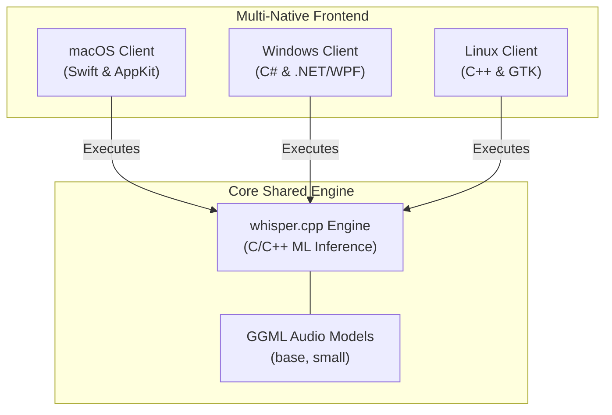
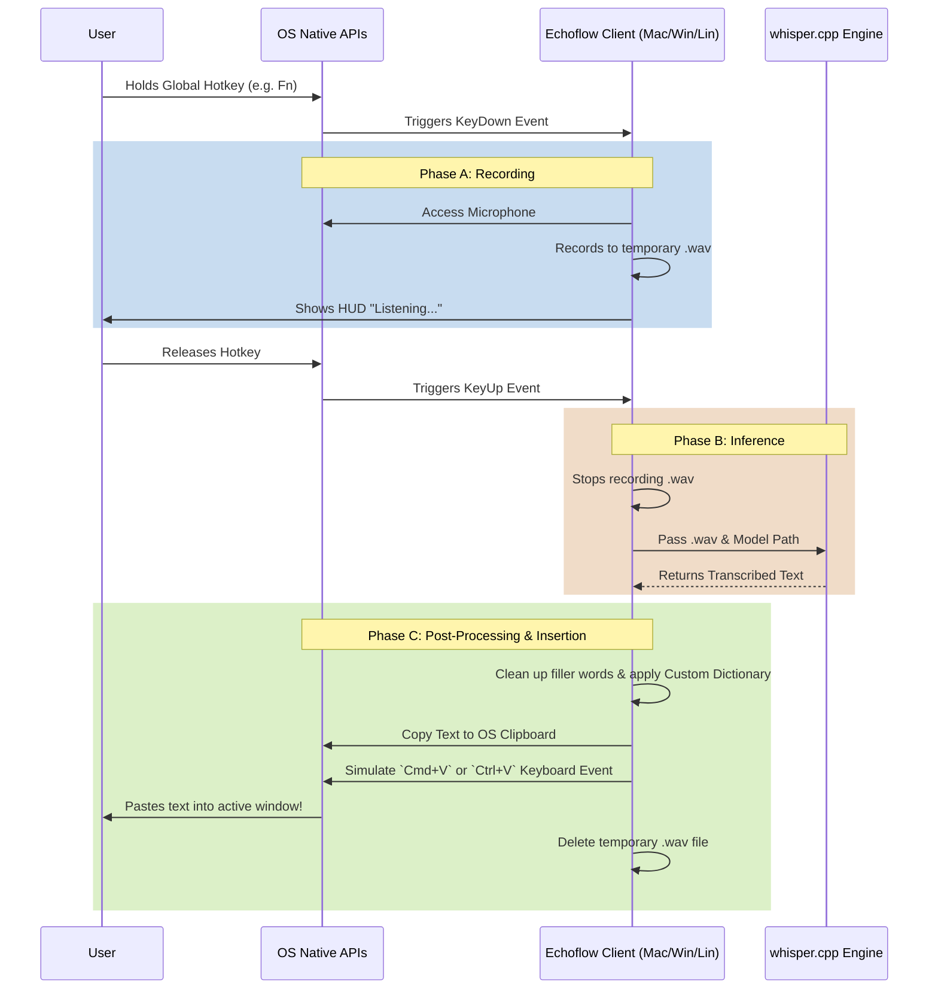

# Project Architecture

Echoflow is built on a **Multi-Native Architecture**. This means instead of using a bloated web framework like Electron, Echoflow provides three entirely separate native applications that all wrap around a single shared, high-performance C++ AI engine.

This approach ensures the app feels 100% native on every operating system, consumes the absolute minimum amount of RAM/battery, and can integrate deeply with OS-specific Accessibility APIs for global hotkeys and seamless typing simulation.

## System Architecture Diagram

---

## The Dictation Lifecycle

Regardless of the operating system, the Echoflow client applications all follow the exact same core dictation lifecycle. The difference is simply in *how* they implement the low-level OS APIs.

---

## Technology Stack Breakdown

### 1. macOS Client (`/macOS`)
- **Language**: Swift
- **UI Framework**: AppKit
- **Audio Capture**: `AVFoundation`
- **Global Hotkeys**: `NSEvent.addGlobalMonitorForEvents`
- **Text Insertion**: `CGEvent` (CoreGraphics keystroke simulation) or `AXUIElement`

### 2. Windows Client (`/Windows`) - *In Progress*
- **Language**: C#
- **UI Framework**: .NET (WPF or WinUI)
- **Audio Capture**: `NAudio` or `Windows.Media.Audio`
- **Global Hotkeys**: `SetWindowsHookEx` (Win32 API)
- **Text Insertion**: `SendInput` (Win32 API)

### 3. Linux Client (`/Linux`) - *In Progress*
- **Language**: C++
- **UI Framework**: GTK
- **Audio Capture**: `ALSA` or `PulseAudio`
- **Global Hotkeys**: `XGrabKey` (X11) or Wayland compositor protocols
- **Text Insertion**: `XTestFakeKeyEvent` or `wtype` (Wayland)

---

## Data Privacy & Storage

Because Echoflow is designed to be fully private, it strictly stores data locally within the operating system's standard application data directory (e.g., `~/Library/Application Support/` on macOS or `%APPDATA%` on Windows).

- `settings.json`: Stores user preferences (hotkeys, formatting rules).
- `dictionary.json`: Stores custom word replacements.
- `history.json`: Stores the log of recent transcriptions.
- `/Models/`: Stores the downloaded `.bin` models if they weren't bundled.

At no point does the application make network requests containing user audio or text. The only network request made by the app is when explicitly downloading a new AI model directly from HuggingFace.
